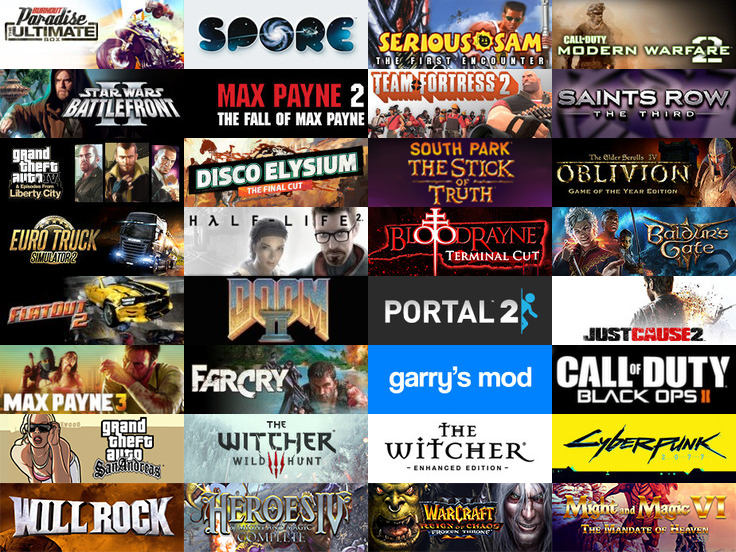

### Hi!

My name is Artem Chernykh. I'm a software developer. I currently live in Yerevan. I work at **Saber Interactive** as a **Tools Programmer**. In my work, I use **WPF** with MVVM and **C#**, sometimes I use **C++**. I love develop convenient tools that make work processes easier and more efficient.

I am currently learning [Godot Engine](https://godotengine.org) and [AvaloniaUI](https://avaloniaui.net) on my own, I have a couple of pet projects that I am slowly but surely doing. :^)

### My current *(alive)* pet-projects:
* [Arcomage](https://github.com/DarkPro1337/arcomage) — fan-remake made on Godot Engine 4
* [GodotHub](https://github.com/DarkPro1337/GodotHub) — AvaloniaUI launcher and instance manager for Godot Engine

### I translated few of guides into Russian from English:
* [Discord Webhooks](https://darkpro1337.github.io/discord-webhooks) — Discord Webhooks Guide *([original](https://birdie0.github.io/discord-webhooks-guide/))*
* [GML Guide](https://darkpro1337.github.io/gml-guide/) — GML Beginner's Guide *([original](https://gdpalace.wordpress.com/learn-gml/))*

### The track I'm obsessed with right now


### Favorite Film and TV Show

  

    Film <a href="https://www.imdb.com/title/tt8367814/" target="_blank">The Gentlemen (2019)</a>
    <video width="100%" autoplay loop muted style="display: block; margin: 0;">
      <source src="https://i.imgur.com/jnME29b.mp4" type="video/mp4">
    </video>
  

  

    TV Show <a href="https://www.imdb.com/title/tt3032476/" target="_blank">Better Call Saul (2015–2022)</a>
    <video width="100%" autoplay loop muted style="display: block; margin: 0;">
      <source src="https://i.imgur.com/plIYuOI.mp4" type="video/mp4">
    </video>
  

### Favourite Games

### Support me

 Patreon



 Ko-fi



 Buy Me a Coffee



 GitHub Sponsors
