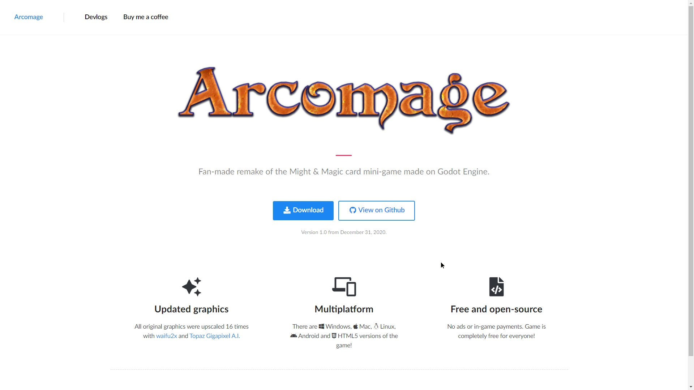
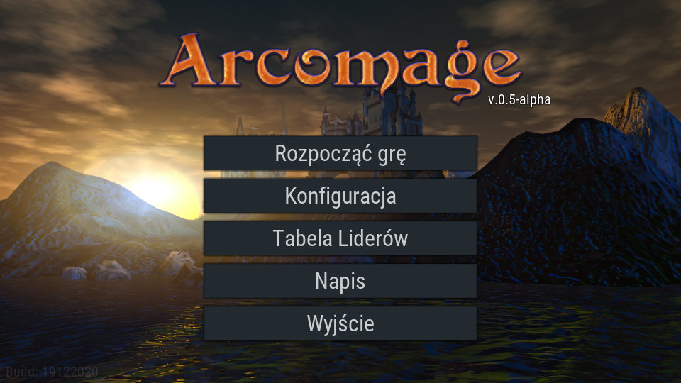

Привет всем! Это снова Артём, я жив, я всё ещё работаю над ремейком Аркомага, последние несколько месяцев я был очень занят из-за учёбы. Но я старался найти время, чтобы сделать хоть какой-то прогресс. Поэтому я хотел бы написать небольшой журнал текущих изменений.

## 1. У игры будет собственный сайт!
Да, у игры уже есть свои страницы на **itch.io** и **GameJolt**, но я подумал, что было бы неплохо, если бы у ремейка был свой собственный сайт.
Выглядит он примерно так.

Основная идея - это **страница, где вы можете скачать последнюю версию** игры с помощью одной кнопки.

## 2. HTML5-версия!
Да, в игру можно играть в браузере. Надеюсь, что эта функция доживет до релиза, но похоже, что **вкладка с игрой потребляет не больше оперативной памяти, чем вкладка YouTube**.

Если все пойдет хорошо, HTML5-версия игры будет такой же, как и обычная, но если что-то пойдет не так, я сделаю отдельную версию игры для браузера.

## 3. Кладбище карт
Это место, куда будут помещаться карты после использования, - довольно простая функция, которая была в оригинальной игре, но я убил на нее много времени.

## 4. Частицы!
Как и в оригинальной игре, карты имеют свои положительные и отрицательные эффекты для игроков, для наглядности отображаемые в виде частиц, разлетающихся от объектов внимания, теперь они есть и в моем ремейке.

## 5. Действие принудительного сброса карт
В оригинальной игре был ряд карт, которые имели принудительное действие сброса, эта функция еще не была реализована в ремейке, НО теперь она есть.

## 6. Локализации!
Оригинальная игра имела разные языковые версии в разных дистрибутивах игры. Это не самый удобный способ поддержки языковых пакетов (локализаций). Теперь вы можете легко перевести игру на свой родной язык. Для этого достаточно связаться со мной и попросить доступ к онлайн-таблице.

## ...и это еще не конец!
Основной функционал игры (в режиме одиночной игры) почти готов! Скоро выйдет первая оффлайн-версия игры. **Следующим крупным обновлением станет онлайновый мультиплеер.**

К сожалению, в данный момент я очень занят учебой и не могу уделять разработке большую часть своего времени, **прошу набраться терпения!**.