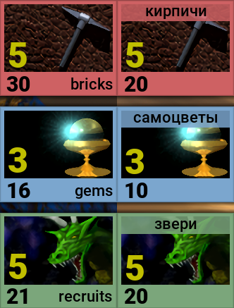

Всем привет! Я закончил университет и получил диплом, уже успел устроиться на работу. Переболел COVID-19, без осложнений, перенёс в относительно легкой форме. **И я готов работать над ремейком дальше!**

Я работал над локализацией, и теперь **карты русской локали полностью локализованы!**

По-прежнему есть проблемы с тем, что названия карт не подходят для русской локали, но в целом все работает нормально.

Также **для локалей, отличных от английской, панели ресурсов будут выглядеть немного по-другому**, из-за того, что названия этих самых ресурсов не вписываются в то место, где они находятся в английской локали. Я просто перенес их наверх, как это было в русской версии Аркомага для PC. Вот небольшой пример этого в игре:

Из текущих планов я бы хотел отметить, что хочу переписать ИИ для бота. Он работает очень странно и иногда зависает в игре. Я бы хотел избавиться от этого и научить его использовать карты с принудительным сбросом. Мне нужно закончить анимацию появления карты в колоде, я до сих пор не понял, как это сделать правильно. Возможно, мне придется кое-что переписать, надеюсь, это не будет большой проблемой.

**Это все новости на текущий день. Спасибо за внимание!**