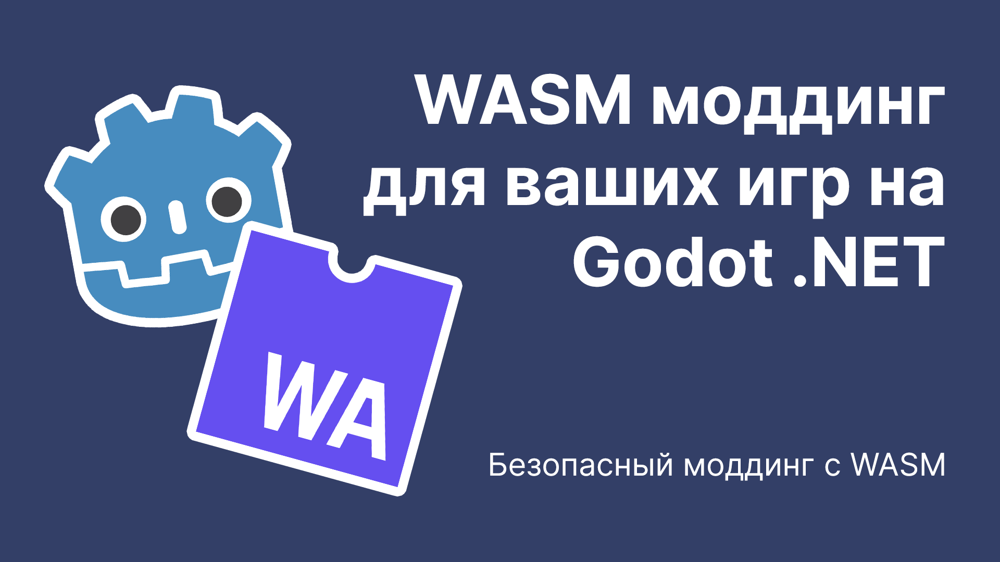

При разработке **Arcomage** на **Godot .NET** возникла задача: как добавить поддержку моддинга через скрипты, не прибегая к прямой инъекции DLL, что небезопасно и может привести к серьезным проблемам, таким как внедрение вирусов или утечка персональных данных.

Чтобы избежать этих рисков, я решил реализовать моды в отдельной песочнице. Цель — создать общее API для модов, чтобы сделать их безопасными и удобными для написания. Меня вдохновило видео [the nameless dev](https://youtu.be/kcWVYeaFmqQ), которое наглядно демонстрирует, как реализовать поддержку WASM модов. Огромное спасибо автору за его знания!

Ранее я знал о WebAssembly, но не рассматривал его как песочницу для модов. Узнав, что даже Microsoft Flight Simulator 2020 использует WASM для выполнения скриптов модов, я понял: это отличная идея!

В этой статье я поделюсь опытом и идеями по внедрению WASM моддинга в Godot .NET.

## Что такое WebAssembly и как его использовать?

**WASM** — это байткод, выполняемый в виртуальной машине. В отличие от CIL в .NET, WASM можно запускать в браузере или любом приложении с поддержкой этого формата. В нашем случае это Godot .NET. Для .NET существует несколько встроенных WASM-рантаймов, и я выбрал [Wasmtime](https://wasmtime.dev/) от Bytecode Alliance.

## Пример создания WASM мода

### Подготовка

1. Добавьте NuGet-пакет Wasmtime в проект:
   ```bash
   dotnet add package wasmtime
   ```
   Или добавьте в `.csproj`:
   ```xml
   <PackageReference Include="Wasmtime" Version="22.0.0" />
   ```
   Затем выполните `dotnet restore`.

2. Для компиляции WASM файлов из **AssemblyScript** установите **Node.js** (npm устанавливается вместе с ним). Скачайте установщик с [официального сайта Node.js](https://nodejs.org/en) и проверьте установки:
   ```bash
   node -v
   npm -v
   ```
   
3. Установите AssemblyScript глобально:
   ```bash
   npm install -g assemblyscript
   ```

### WASM

Создайте в выбранной директории два файла: `env.ts` и `mod.ts`.

В `env.ts` объявите экспортируемые функции:
```typescript
@external("env", "host_log")
declare function host_log(ptr: i32, len: i32): void;

export function log(message: string): void {
  const encoded = String.UTF8.encode(message);
  host_log(changetype<i32>(encoded), encoded.byteLength);
}
```
Функция `log` передаёт сообщение через `host_log`, которая принимает указатель на строку и её длину.

В `mod.ts` напишите код мода:
```typescript
import { log } from "./env";

export function init(): void {
  log("Hello, World!");
}
```
Функция `init` служит точкой входа и вызывается при инициализации мода.

Скомпилируйте мод:
```bash
asc .\mod.ts -o mod.wasm
```
После компиляции в директории появится файл `mod.wasm`.

### Интеграция с Godot .NET

1. Поместите скомпилированный `mod.wasm` в директорию `user` вашего Godot проекта (например, `user://mod.wasm`).  
   Рекомендую использовать пользовательскую директорию (настраивается через `application/config/use_custom_user_dir` и `application/config/custom_user_dir_name` в `project.godot`).

2. Создайте новый C# класс, наследующий `Node` (например, `WasmLoader`):
   ```csharp
   using Godot;
   using System.Text;
   using Wasmtime;
   using Engine = Wasmtime.Engine;

   public partial class WasmLoader : Node
   {
      public override void _Ready()
      {
         byte[] wasmBytes;
         using (var file = FileAccess.Open("user://mod.wasm", FileAccess.ModeFlags.Read))
            wasmBytes = file.GetBuffer((int)file.GetLength());

         using var engine = new Engine();
         using var module = Module.FromBytes(engine, "mod", wasmBytes);
         using var store = new Store(engine);
         using var linker = new Linker(engine);

         linker.Define("env", "host_log", Function.FromCallback(store, (Caller caller, int ptr, int len) =>
         {
            var memory = caller.GetMemory("memory");
            if (memory is null)
               return;
            var span = memory.GetSpan<byte>(0);
            var message = Encoding.UTF8.GetString(span.Slice(ptr, len).ToArray());
            GD.Print(message);
         }));

         linker.Define("env", "abort", Function.FromCallback(store, (int msg, int file, int line, int column) =>
         {
            GD.Print($"Abort called at {file}:{line}:{column}");
         }));

         var instance = linker.Instantiate(store, module);
         instance.GetAction("init")?.Invoke();
      }
   }
   ```
   
Разберем, что происходит в коде:

- Загружается WASM файл из `user://mod.wasm` и его байты передаются в `Module.FromBytes`.
- Создаются объекты `Engine`, `Module`, `Store` и `Linker` для выполнения мода.
- Определяются экспортированные функции: `host_log` (декодирует строку из памяти и выводит её) и `abort` (обрабатывает ошибки модов).
- Инстанцируется мод и вызывается функция `init`, выводящая "Hello, World!".

Добавьте `WasmLoader` в сцену или настройте его в `Autoload` для автоматического запуска.

## Дальнейшие шаги

1. **Проброс Process Callback:**  
   Пробрасывайте вызовы `_Process` и `_PhysicsProcess` в моды, передавая параметр `delta`, чтобы моды могли обновлять состояние игры:
   ```csharp
   public override void _Process(double delta)
   {
      foreach (var mod in _mods.Values)
         mod.Instance.GetFunction("process")?.Invoke(delta);
   }
   ```
   Здесь `_mods` — `Dictionary`, где ключом является имя мода, а значением — его инстанс и путь. Аналогично можно передавать события, например, при выходе из игры.

2. **Создание API для модов:**  
   Разработайте понятный API, предоставляющий функции вроде `log`, `spawn`, `destroy`, `move` и т.д. Задокументируйте его для удобства моддеров.

3. **Автоматическая загрузка модов:**  
   Реализуйте функционал для загрузки WASM модов из отдельной папки, чтобы моддеры могли просто добавлять свои моды для автоматической загрузки. Не забудьте предусмотреть возможность их выгрузки для оптимизации работы игры.

Надеюсь, эта небольшая статья поможет вам внедрить WASM моддинг в ваши игры на Godot .NET. Если возникнут вопросы или потребуется помощь, оставляйте комментарии — я постараюсь помочь!