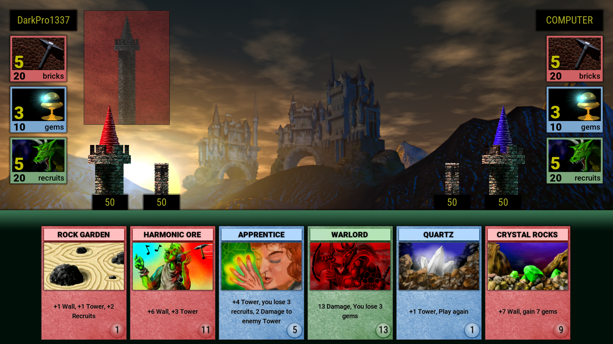

Hello! I am an indie developer working on a remake of the Might & Magic series card mini-game called Arcomage.

I really love **Arcomage** and want to make a really good remake. I try very hard to keep its original appearance. I don't want to add any other balance-breaking functionality. Perhaps later I will add a direct ability to create my own decks, something like mods, both based on a standard deck of cards, and completely your own. At the moment I am working on repeating the version that was in Might and Magic itself, i.e. version for one player, and a computer as an opponent. Later I will be working on multiplayer modes. Since I develop all this alone, I do not have a release date for specific versions.

What has already been done so far:
* Fully updated graphics (using upscale via Topaz Gigapixel AI and waifu2x). Now all the graphics look just fine, and just like in the original.
* Moved the entire original card deck to the database for ease of localization. The whole interface is also easy to localize.
* Basic mechanics. Using cards and their scripts.
* The original sounds have been carried over to the remake. I am thinking about improving their quality, but I don’t know how to do it yet.
* Original interface. Everything looks exactly the same as in the original. And then there are the cool particles!
* Some kind of AI for the opponent (computer). I already really want to rewrite it from scratch, but all the hands do not reach.

> You can find a list of all the planned features or features that I'm working on now, well, just the progress of the project, on my [Trello board](https://trello.com/b/nQuzlNk5/arcomage-remake).

**Thank you all very much for your interest in the project.**

Thanks to [Alexander Krop](https://www.youtube.com/channel/UC8HnwuT88qHrixEJPdlJMvQ) for initiation to the wonderful world of Might and Magic and Arcomage in particular. Thanks a lot to him for the inspiration to make this remake.

Thanks to the cool guys from the [r/MightAndMagic subreddit](https://www.reddit.com/r/MightAndMagic/), they very warmly accepted [my post about the fact that I am developing a remake](https://www.reddit.com/r/MightAndMagic/comments/iz78ye/arcomage_fanremake_i_working_on_here_is_some/).