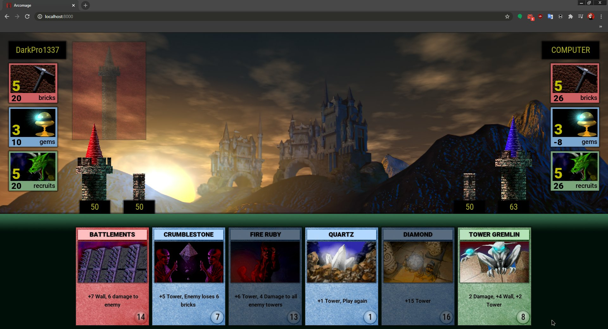

Hello everyone! It's Artеm again, I'm alive, I'm still working on the remake of Arcomage, I've been very busy the last few months because of my studies. But I tried to find time to make some progress. So I would like to write a small change log of current updates.

## 1. The game will have its own website!
Yes, the game already has its own pages on **itch.io** and **GameJolt**, but I thought it would be nice if the remake had its own website.
It looks something like this.

The main idea is a **page where you can download the latest version** of the game with one button.

## 2. HTML5 version!
Yes, the game can be played in the browser. I hope this feature will live to release, but it seems like the **tab with the game eats no more RAM than YouTube tab**.

If everything goes well, the HTML5 version of the game will be the same as the usual one, but if something goes wrong, I will make a separate version of the game for the browser.

## 3. Card graveyard
This is the place where the cards will be placed after use, a fairly simple feature that was in the original game, but I killed a lot of time on it.

## 4. Particles!
As in the original game, cards have their own positive and negative effects for players, for clarity, which are displayed in the form of particles scattering from objects of attention, they are now in my remake.

## 5. Force card discarding action
In the original game, there were a number of cards that had a forced discard action, this function has not yet been implemented in the remake, BUT now it is.

## 6. Localizations!
The original game had different language versions as different distributions of the game. This is not the most convenient way to support language packs (locales). Now you can easily translate the game into your native language. You just need to contact me and ask for access to the online spreadsheet.

## ...and this isn't end!
The main functionality of the game (in single player mode) is almost ready! The first offline version of the game will be out soon. **The next major update will be online multiplayer.**

Unfortunately, at the moment I am very busy with my studies, and I cannot devote most of my time to development, **please be patient!**