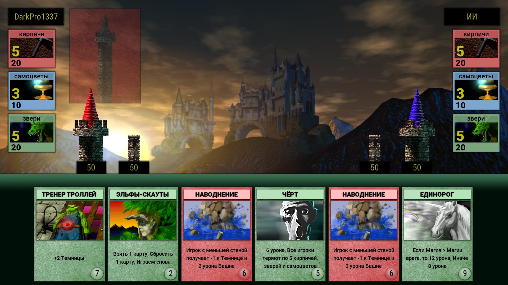
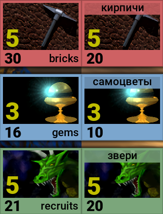

Hello everyone! I graduated from the university and received a diploma, already managed to get a job. Had been ill with COVID-19, without complications, suffered in a relatively mild form. **And I'm ready to work on the remake further!**

I worked on localizations, and now the **cards of the Russian locale are completely localized!**

There are still problems with the fact that the names of the cards do not fit in the Russian locale, but in general everything works fine.

Also, **for locales other than the English, the resources panels will look a little different**, due to the fact that the names of these same resources do not fit in the place where they are located in the English locale. I just moved them up, as it was in the Russian version of Arcomage for PC. Here is a little example of it in-game:

Of the current plans, I would like to note that I want to rewrite the AI ​​for the bot. It works very strangely, and sometimes hangs up the game. I would like to get rid of this, and teach him how to use cards with forced discards. I need to finish the animation of the appearance of the card in the deck, I still haven't figured out how to do it correctly. I may have to rewrite something, I hope this will not be a big problem.

**This is all news for the current day. Thank you for your attention!**